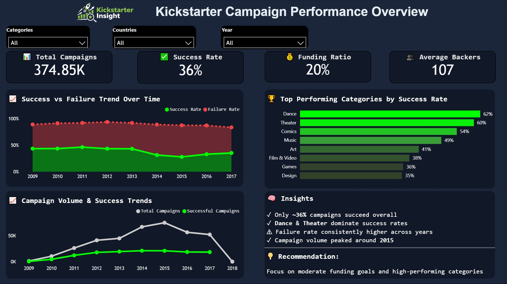
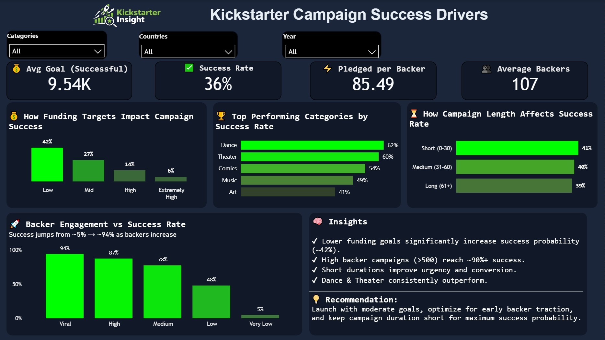

# Kickstart Campaigns Analysis

---

## Project Overview
This project analyzes Kickstarter campaign data to reveal hidden trends and insights that can help creators optimize their campaigns for success.

We explore various factors such as campaign duration, funding goals, category performance, and more to understand what contributes to a successful Kickstarter campaign.

---

## Dashboard Preview

### 🔹 Overview Dashboard

### 🔹 Success Drivers Dashboard

---

## About the Dataset
The dataset contains information about Kickstarter campaigns, including:
- Campaign name
- Category
- Funding goal
- Amount pledged
- Number of backers
- Campaign duration
- Launch date
- Campaign state (successful, failed, etc.)

**This data allows us to perform a comprehensive analysis of the factors influencing campaign success.**

---

## Core Business Questions
**1. What percentage of Kickstarter campaigns succeed vs fail?**

**2. Does funding goal impact success?**

**3. How does the number of backers influence campaign success?**

**4. Does Campaign Duration Influence Success?**

---

## Skills Used
**Technical Skills**
- SQL (MySQL)
- Python
- Data Analysis
- Exploratory Data Analysis (EDA)

**Analytical Skills**
- Business problem translation
- Data-driven decision making
- Behavioral pattern analysis

## Tech Stack
- SQL (MySQL)
- Python (Pandas, Matplotlib, Seaborn)
- Power BI (Dashboarding & Data Modeling)

## Future Improvement
- Building an **interactive dashboard using Power BI(Done)**
- Developing a **machine learning model to predict campaign success**
- Analyzing **category-specific success patterns**

## Author
**Bhaskar Arya**